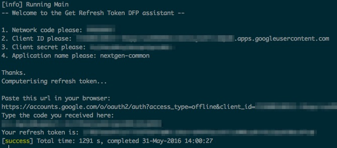

# googleads-get-refresh-token
A command-line tool to help generate googleads refresh tokens. This simplifies the task of getting your dfp refresh token, described in [the google docs](https://developers.google.com/doubleclick-publishers/docs/start#signup)

## Getting your keys

Before running the command-line tool, make sure you have the following:

1. Network code - The dfp network code can be found at the top of the dfp [home page](https://www.google.com/dfp). Ask a team member if you are unsure.
2. Client ID
3. Client secret - Your client authentication details need to be generated from within the Google developers console. Follow the steps [here](https://developers.google.com/doubleclick-publishers/docs/authentication#1_determine_your_authentication_type) to create authentication credentials for a service account.
4. Application name - This can be any string of your choice. We use something like 'guardian' or 'nextgen-common'.

Now you can run the `googleads-get-refresh-token` project interactively. Start the sbt project (run sbt from this project directory), and type 'run'.

Input the data mentioned above, and follow the steps. A typical run should look like this:

